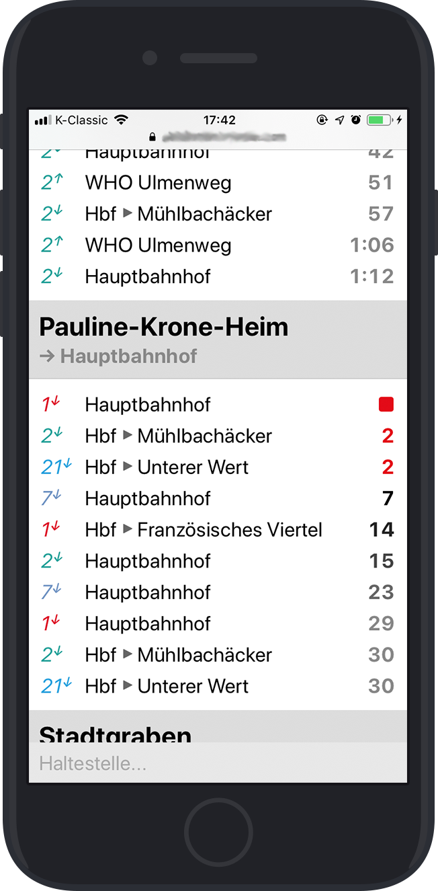

# abfahrten

<!-- https://dribbble.com/shots/3516645-Free-iPhone-7-iPhone-7-Plus-Mockup -->

Ein besseres¹ Interface zum [Online-Abfahrtsmonitor der Stadtwerke Tübingen](https://www.swtue.de/abfahrt.html), das auch im lückenhaften O₂-Netz verlässlich² lädt. Aktuell stark auf meine eigenen Bedürfnisse³ abgestimmt.

Da für jeden Aufruf eine entsprechende Anfrage an den offiziellen Abfahrtsmonitor abgefeuert wird, ist diese Software nicht für den öffentlichen Einsatz gedacht – die Stadtwerke würden das vermutlich nach einer Weile blockieren. Aus diesem Grund gibt es an dieser Stelle auch keinen Demo-Link.

## Installation

Inhalt dieses Repositories ins `public_html`-Verzeichnis eines PHP-fähigen Webservers schieben. Fertig. Handelsübliche Sharehosting-Angebote sollten wohl funktionieren.

## Konfiguration

Über `defaults.json` und/oder durch allgemeine Hackbarkeit.

## Wartung

Falls Haltestellen hinzukommen oder entfernt werden, muss `stops.json` entsprechend neu aus der gegen Ende des Quellcodes von `https://www.swtue.de/abfahrt.html` eingebetteten JavaScript-Datei herauskopiert werden.

---

¹ Finde ich. [Deine Kilometerleistung kann variieren.](https://www.urbandictionary.com/define.php?term=ymmv) 
² Ein einziger HTTP-Request ist nötig, um die Standardansicht mit allen Haltestellen, die in `defaults.json` als `"expand": true` markiert sind, zu laden. 
³ Deswegen ist `defaults.json` nicht in der `.gitignore`.
